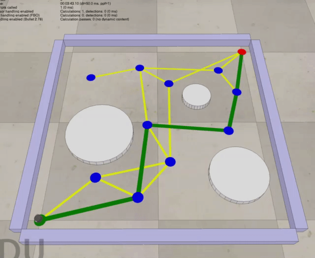

# Modern Robotics: Mechanics, Planning, and Control Specialization

Here are my assignment submissions for the Coursera specilization `Modern Robotics: Mechanics, Planning, and Control Specialization` taughy by Prof. Kevin Lynch from Northwestern University.

As per the requirements of Coursera, all the code submissions and quizzes are omitted, and the following robot animations are simulated in `coppeliaSim Edu`.

## Course 6: Mobile Robot Manipulation

### Assignment Stage 1: YouBot kinematics simulation with first-order Euler step and odometry

### Assignment Stage 2: Reference trajectory generation for the end-effector frame

### Stage 3: Feedforward control with Jacobian pseudoinverse to convert twist into control commands

### Assignment Stage 4: PI-control and evaluation under different scenarios

| Well-tuned Behaviour |  Overshoot Behaviour | Different Target Configuration |
:---:|:---:|:---:
  |  |  |
  |  |  |

## Course 5: Grasping and Manipulation, Wheeled Mobile Robots
### Coding Assignment: Evaluate form closure and force closure with linear programming

## Course 4: Motion Planning and Robot Control
### Coding Assignment: Sampling-base planner, rapidly exploring random trees(RRT) or probabilistic roadmaps (PRMs)

| A* Search |  Rapidly Exploring Random Trees|
:---:|:---:
  |  |

## Course 3: Dynamics of Open-Chain robots and Trajectory Generation
### Coding Assignment: Forward dynamics simulation for UR5 robots (Friction is not considered)

| Falling from Zero Configuraiton | Falling from Different Configuration |
:---:|:---:
  |  |

## Course 2: Forward kinematics, velocity kinematics, and inverse kinematics
### Coding Assignment: Newton-Raphson inverse kinematics for the UR5 robot.

| Newton-Raphson Iterations | Achieved Configurations |
:---:|:---:
|   |   |

## Course 1: Configuration space and Rigid-body motions
### Coding Assignment: Visualize the configuration of the robot's end-effector in $T(\theta)\in SE(3)$ with given joint positions $\theta$.
